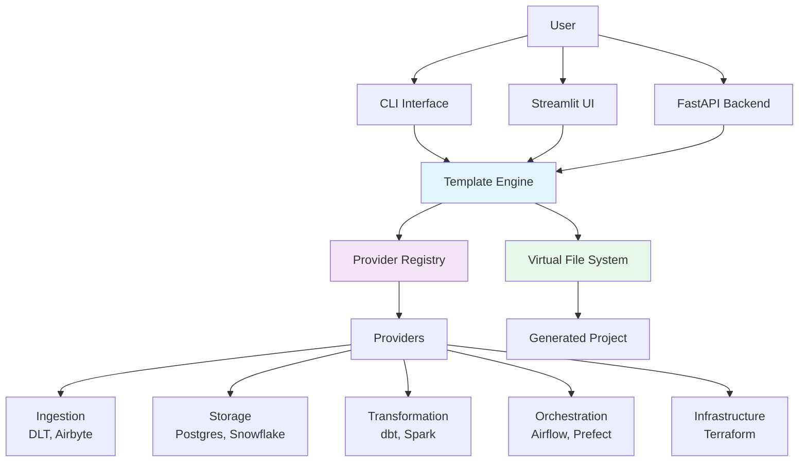

# 🚀 AntiGravity - Data Project Generator

**Generate production-ready data engineering projects in seconds**

AntiGravity is a powerful platform that automatically generates complete data engineering stacks with Docker, orchestration, transformation, and infrastructure as code. Choose your tools, click generate, and get a fully configured project ready to deploy.

[](https://www.python.org/downloads/)
[](LICENSE)
[](https://github.com/psf/black)

---

## ✨ Features

- 🎯 **Stack-Agnostic**: Mix and match from 15+ data tools
- 🐳 **Docker-Ready**: Complete docker-compose.yml with networking
- 🔒 **Secrets Management**: Auto-generated secure credentials
- 📊 **Architecture Diagrams**: Mermaid.js visualizations included
- 🎨 **Three Interfaces**: CLI, Streamlit UI, or REST API
- 📦 **Zero Config**: Projects run out of the box with `docker-compose up`

---

## 🏗️ Architecture



---

## 🚀 Quick Start

### Prerequisites

- Python 3.9+
- Git

### Installation

```bash
# Clone the repository
git clone https://github.com/yourusername/antigravity.git
cd antigravity/DataEng

# Create virtual environment
python -m venv .venv

# Activate virtual environment
# Windows:
.venv\Scripts\activate
# Linux/Mac:
source .venv/bin/activate

# Install dependencies
pip install -r backend/requirements.txt
```

### Usage

#### Option 1: CLI (Interactive)

```bash
python cli.py
```

Follow the interactive prompts to select your stack and generate a project.

#### Option 2: Streamlit UI (Web Interface)

```bash
streamlit run ui/app.py
```

Open your browser to `http://localhost:8501` and use the visual interface.

#### Option 3: API (Programmatic)

```bash
# Start the API server
cd backend
uvicorn main:app --reload

# In another terminal, make a request
curl -X POST http://localhost:8000/api/v1/generator/create \
  -H "Content-Type: application/json" \
  -d '{
    "project_name": "my_data_project",
    "stack": {
      "ingestion": "DLT",
      "storage": "PostgreSQL",
      "transformation": "dbt",
      "orchestration": "Airflow",
      "infrastructure": "terraform"
    }
  }'
```

---

## 📦 Available Providers

### Ingestion
- **DLT** - Data Load Tool for Python-native pipelines

### Storage
- **PostgreSQL** - Open-source relational database

### Transformation
- **dbt** - Data build tool for SQL transformations

### Orchestration
- **Airflow** - Workflow orchestration platform

### Infrastructure
- **Terraform** - Infrastructure as Code (AWS, GCP)

> More providers coming soon! (Snowflake, Prefect, Airbyte, Metabase, etc.)

---

## 📚 Documentation

- **[CLI Guide](CLI_GUIDE.md)** - Detailed CLI usage
- **[Contributing](CONTRIBUTING.md)** - Development guidelines
- **[Architecture](docs/ARCHITECTURE.md)** - Platform architecture details
- **[API Docs](http://localhost:8000/docs)** - Interactive API documentation (when server is running)

---

## 🎯 Example: Generated Project

When you generate a project with the stack above, you'll get:

```
my_data_project/
├── docker-compose.yml          # All services configured
├── .env.example                # Environment template
├── Makefile                    # Common commands
├── README.md                   # Project-specific docs
├── ARCHITECTURE.md             # Mermaid diagram
├── dags/
│   └── pipeline_dag.py         # Airflow DAG
├── dbt_project/
│   ├── dbt_project.yml
│   └── models/
├── ingestion_pipeline.py       # DLT pipeline
└── terraform/
    ├── main.tf                 # Infrastructure
    └── variables.tf
```

**Next steps after generation:**
```bash
cd my_data_project
cp .env.example .env
# Edit .env with your credentials
docker-compose up
```

---

## 🧪 Testing

```bash
# Run all tests
pytest

# Run with coverage
pytest --cov=backend --cov-report=html

# Run specific test file
pytest tests/core/test_engine.py
```

---

## 🛠️ Development

### Project Structure

```
DataEng/
├── backend/
│   ├── api/              # FastAPI routes
│   ├── core/             # Core engine, providers, registry
│   │   ├── providers/    # Component generators
│   │   └── utils/        # Utilities
│   ├── templates/        # Jinja2 templates
│   └── main.py          # FastAPI app
├── cli.py               # CLI interface
├── ui/
│   └── app.py           # Streamlit UI
├── tests/               # Test suite
└── generated_projects/  # Output directory
```

### Adding a New Provider

1. Create provider class in `backend/core/providers/`
2. Implement `ComponentGenerator` interface
3. Register with `ProviderRegistry.register()`
4. Add templates to `backend/templates/`
5. Add tests to `tests/providers/`

See [CONTRIBUTING.md](CONTRIBUTING.md) for details.

---

## 🤝 Contributing

Contributions are welcome! Please read [CONTRIBUTING.md](CONTRIBUTING.md) for:
- Code style guidelines
- Development setup
- Pull request process
- Testing requirements

---

## 📄 License

This project is licensed under the MIT License - see the [LICENSE](LICENSE) file for details.

---

## 🙏 Acknowledgments

- Built with [FastAPI](https://fastapi.tiangolo.com/)
- UI powered by [Streamlit](https://streamlit.io/)
- CLI with [Rich](https://github.com/Textualize/rich)
- Templates with [Jinja2](https://jinja.palletsprojects.com/)

---

## 📧 Support

- **Issues**: [GitHub Issues](https://github.com/yourusername/antigravity/issues)
- **Discussions**: [GitHub Discussions](https://github.com/yourusername/antigravity/discussions)

---

**Made with ❤️ for Data Engineers**
