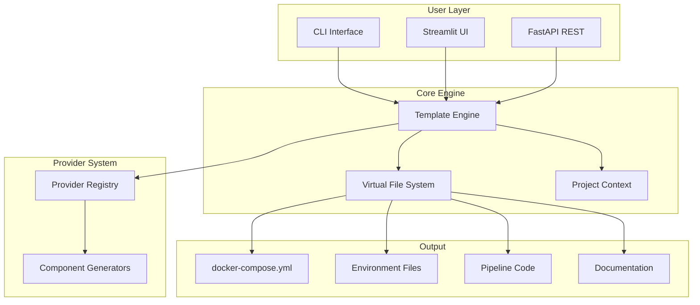
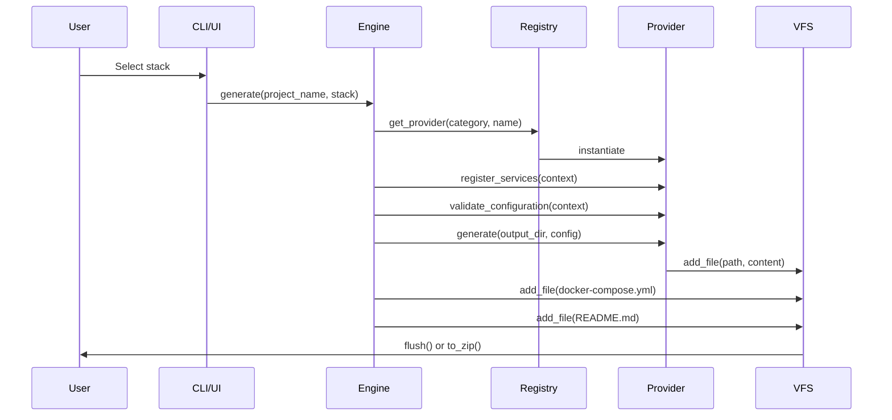
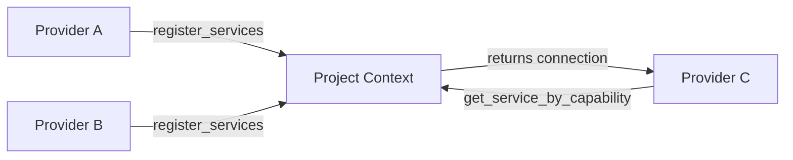

# AntiGravity - Technical Architecture

**Version:** 1.0.0  
**Last Updated:** December 2024

---

## System Overview

AntiGravity is a data engineering project generator that creates production-ready stacks with automated configuration, dependency resolution, and multi-provider support.



---

## Core Components

### 1. Template Engine

**Location:** `backend/core/engine.py`

**Responsibilities:**
- Orchestrates project generation workflow
- Manages 4-phase generation process
- Coordinates provider interactions
- Generates unified docker-compose configuration

**4-Phase Workflow:**

```python
# Phase 1: Initialization
- Instantiate component generators
- Register services in ProjectContext
- Build dependency graph

# Phase 2: Validation
- Validate component configurations
- Verify service dependencies
- Check stack compatibility

# Phase 3: Auto-configuration
- Auto-discover services
- Generate connection strings
- Resolve ports and secrets

# Phase 4: Generation
- Topological generation (dependencies first)
- Render Jinja2 templates
- Build unified docker-compose
- Generate documentation
```

### 2. Virtual File System (VFS)

**Purpose:** In-memory file management before writing to disk

**Capabilities:**
- Add/get files in memory
- List all generated files
- Write to disk (`flush()`)
- Export as ZIP (`to_zip()`, `to_bytes_zip()`)

**Usage:**
```python
vfs = VirtualFileSystem()
vfs.add_file("README.md", content)
vfs.add_file("docker-compose.yml", compose_content)

# Option 1: Write to disk
vfs.flush("./output/my_project")

# Option 2: Create ZIP
vfs.to_zip("./my_project.zip")

# Option 3: In-memory ZIP (for web downloads)
zip_bytes = vfs.to_bytes_zip()
```

### 3. Provider Registry

**Location:** `backend/core/registry.py`

**Pattern:** Singleton registry with 8 categories

**Categories:**
- `ingestion` - Data ingestion tools
- `storage` - Databases and warehouses
- `transformation` - Data transformation engines
- `orchestration` - Workflow orchestrators
- `infrastructure` - IaC tools
- `visualization` - BI and dashboards
- `quality` - Data quality validation
- `monitoring` - Observability tools

**API:**
```python
# Register provider
ProviderRegistry.register("storage", "PostgreSQL", PostgreSQLProvider)

# Get provider
provider_cls = ProviderRegistry.get_provider("storage", "PostgreSQL")

# List all
providers = ProviderRegistry.get_all_providers()
```

### 4. Project Context

**Location:** `backend/core/manifest.py`

**Purpose:** Global state shared across all generators

**Features:**
- 🔐 Secret management (auto-generated secrets)
- 🔌 Service discovery and registration
- 🌐 Port management (collision avoidance)
- 🔗 Connection string generation
- ✅ Dependency validation

**Example:**
```python
context = ProjectContext(
    project_name="my_project",
    project_id=str(uuid.uuid4()),
    base_dir="/app"
)

# Auto-generate secrets
password = context.get_or_create_secret("postgres_password")

# Register services
context.register_connection(ServiceConnection(
    name="postgres",
    type="postgres",
    host="postgres",
    port=5432,
    capabilities=["database", "sql_database"]
))

# Discover services
db = context.get_service_by_capability("database")
```

### 5. Component Generator Interface

**Location:** `backend/core/interfaces.py`

**Abstract Methods (required):**
```python
@abstractmethod
def generate(output_dir: str, config: Dict) -> None
    """Generate component files"""

@abstractmethod
def get_docker_service_definition(context: ProjectContext) -> Dict
    """Return Docker Compose service config"""

@abstractmethod
def get_env_vars(context: ProjectContext) -> Dict[str, str]
    """Return environment variables"""
```

**Optional Methods:**
```python
def get_requirements() -> List[str]
    """Python dependencies"""

def register_services(context: ProjectContext) -> None
    """Register provided services"""

def get_dependencies() -> List[str]
    """Declare required dependencies"""

def validate_configuration(context: ProjectContext) -> Tuple[bool, str]
    """Validate can generate with current config"""

def get_connection_string(context: ProjectContext, target: str) -> str
    """Generate connection string"""
```

---

## Data Flow

### Project Generation Flow



### Service Discovery Flow



---

## Provider Implementation

### Example: PostgreSQL Provider

```python
class PostgreSQLProvider(ComponentGenerator):
    def generate(self, output_dir: str, config: Dict[str, Any]):
        """Generate PostgreSQL initialization scripts"""
        init_sql = self.env.get_template("storage/init_db.sql.j2")
        # Render and write to VFS
    
    def get_docker_service_definition(self, context: ProjectContext):
        password = context.get_or_create_secret("postgres_password")
        
        return {
            "postgres": {
                "image": "postgres:15",
                "environment": {
                    "POSTGRES_PASSWORD": password,
                    "POSTGRES_DB": "warehouse"
                },
                "ports": ["5432:5432"],
                "volumes": ["postgres_data:/var/lib/postgresql/data"]
            }
        }
    
    def get_env_vars(self, context: ProjectContext):
        return {
            "POSTGRES_HOST": "postgres",
            "POSTGRES_PORT": "5432",
            "POSTGRES_DB": "warehouse",
            "POSTGRES_USER": "postgres",
            "POSTGRES_PASSWORD": context.get_or_create_secret("postgres_password")
        }
    
    def register_services(self, context: ProjectContext):
        context.register_connection(ServiceConnection(
            name="postgres",
            type="postgres",
            host="postgres",
            port=5432,
            capabilities=["database", "sql_database", "warehouse"]
        ))
```

---

## Template System

### Directory Structure

```
backend/templates/
├── common/
│   ├── README.md.j2
│   ├── Makefile.j2
│   ├── docker-compose.yml.j2
│   ├── env.example.j2
│   └── devcontainer.json.j2
├── ingestion/
│   └── dlt_pipeline.py.j2
├── transformation/
│   ├── dbt_project.yml.j2
│   └── profiles.yml.j2
└── orchestration/
    └── airflow_dag.py.j2
```

### Template Context

Common variables available in all templates:

```python
{
    "project_name": str,
    "stack": Dict[str, str],
    "services": Dict[str, Dict],
    "env_vars": Dict[str, str],
    "volumes": Dict[str, Any],
    "networks": Dict[str, Any]
}
```

---

## Testing Architecture

### Test Organization

```
tests/
├── conftest.py              # Shared fixtures
├── templates/
│   └── test_template_validation.py   # Template syntax tests
├── integration/
│   └── test_full_workflow.py         # End-to-end tests
├── core/
│   ├── test_engine.py               # Engine tests
│   ├── test_manifest.py             # Context tests
│   └── test_registry.py             # Registry tests
├── api/
│   └── test_generator.py            # API tests
└── providers/
    ├── test_ingestion.py            # Provider tests
    └── test_storage.py
```

### Test Coverage Goals

- **Template validation:** 100% of templates
- **Core components:** >90%
- **Providers:** >80%
- **Integration:** Key workflows

---

## Configuration Management

### Environment Variables

Generated in `.env.example`:

```bash
# Database
POSTGRES_HOST=postgres
POSTGRES_PORT=5432
POSTGRES_DB=warehouse
POSTGRES_USER=postgres
POSTGRES_PASSWORD=CHANGE_ME

# Airflow
AIRFLOW_WEBSERVER_PORT=8080
AIRFLOW_DB_PASSWORD=CHANGE_ME
```

### Secrets Management

Secrets are auto-generated using:
```python
context.get_or_create_secret("key_name", length=16)
```

Stored in `SecretRegistry` during generation, output to `.env.example` with placeholder values.

---

## Deployment Architecture

### Generated Project Structure

```
my_data_project/
├── docker-compose.yml       # All services
├── .env.example            # Environment template
├── Makefile                # Common commands
├── README.md               # Project docs
├── ARCHITECTURE.md         # Mermaid diagram
├── dags/                   # Airflow DAGs
├── dbt_project/            # dbt models
├── pipelines/              # DLT pipelines
├── terraform/              # Infrastructure
└── .devcontainer/          # VS Code dev container
```

### Docker Compose Services

Services are dynamically generated based on selected stack:

- **PostgreSQL:** Database service
- **Airflow:** Webserver, scheduler, worker
- **dbt:** As part of Airflow
- **Monitoring:** Prometheus, Grafana

---

## Extension Points

### Adding a New Provider

1. **Create provider class:**
```python
# backend/core/providers/storage_newdb.py
class NewDBProvider(ComponentGenerator):
    # Implement abstract methods
```

2. **Register provider:**
```python
# In __init__.py
ProviderRegistry.register("storage", "NewDB", NewDBProvider)
```

3. **Create templates:**
```
backend/templates/storage/newdb_config.j2
```

4. **Add tests:**
```python
# tests/providers/test_newdb.py
```

---

## Performance Considerations

### Generation Time

- **Target:** <5 seconds for full stack
- **Bottlenecks:** Template rendering, file I/O
- **Optimization:** VFS (in-memory), lazy loading

### Memory Usage

- **VFS:** Stores all files in memory during generation
- **Typical project:** ~5-10 MB
- **Cleanup:** VFS cleared after flush/export

---

## Security

### Best Practices

✅ **Secrets:** Auto-generated, not hardcoded  
✅ **Templates:** No hardcoded credentials  
✅ **Validation:** Input sanitization  
✅ **Dependencies:** Pinned versions in generated projects

---

## Future Enhancements

See `implementation_plan.md` for P1-P3 roadmap:

- P1: Project updates, custom templates, cloud deployment
- P2: ML providers, data lineage, VS Code extension
- P3: Web builder, marketplace, cost estimation

---

**Maintained by:** AntiGravity Team  
**License:** MIT
